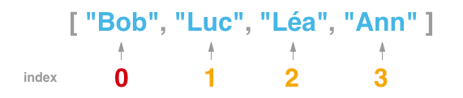
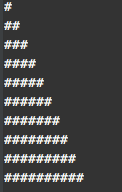
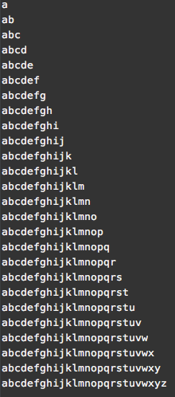

<div class="sommaire">
    <div class="sommaire-col">
        <h2>Intro</h2>
        <a href="#type-de-donnes">Types de données</a>
        <a href="#des-instructions">Des instructions</a>
        <a href="#conditions">Les conditions</a>
        <a href="#comparaison-et-conditions">Comparaisons et condition</a>
        <a href="#les-commentaires">Les commentaires</a>
        <a href="#les-tableaux">Les tableaux</a>
        <a href="#fonctions-js">Fonctions JS</a>
        <span><a href="#les-boucles">Les boucles</a> : <a href="#while">While</a>, <a href="#for">For</a></span>
        <a href="#scope-et-porte-de-variables">Scope et portée de variables</a>
        <a href="#objets">Objects</a>
        <a href="#objets-vs-tableaux">Objets Vs Tableaux</a>
        <a href="#les-dates">Les dates</a>
    </div>
    <div class="sommaire-col">
        <h2>Débutant</h2>
        <a href="#html-et-js--manipulation-du-dom">HTML & JS : Manipulation du DOM</a>
        <a href="#introduction-aux-venements">Evénements DOM</a>
        <a href="#window">Window</a>
        <a href="#document">Document</a>
        <a href="#formulaires">Formulaires</a>
        <a href="#html-dynamique">HTML dynamique</a>
        <a href="#objets-js">Objets JS</a>
        <a href="#jquery">JQuery</a>
        <a href="#js-pourquoi-faire">JS pourquoi faire</a>
        <a href="#modele-venementiel">Modele évenementiel</a>
        <a href="#data---attributes">Data-attributes</a>
        <a href="#ajax">Ajax</a>
    </div>
    <div class="sommaire-col">
        <h2>Intermédiaire</h2>
        <a href="#arraymap-et-arrayfilter">Array.Map et Array.Filter</a>
        <a href="#arrayreduce">Array.reduce</a>
        <a href="#js-moderne">JS Moderne : NPM, Babel</a>
        <a href="#es6">ES6</a>
        <a href="#react">Introduction à React</a>
        <hr>
        <a href="#corrections"><h4>Corrections</h4></a>
        <a href="#outils"><h4>Outils</h4></a>
        <a href="#Annexes"><h4>Ressources</h4></a>
        <a href="#ressources"><h4>Annexes</h4></a>
    </div>
</div>

Programmer c'est donner une série d'instructions à un ordinateur (ou autre chose : un réveil, un four, un robot...).

Dans le cas d'un ordinateur, on utilisera :

- un *langage* informatique
- ou une interface graphique

### Type de données

La programmation permet de manipuler des données de différents types.

- des valeurs numériques : 1, 178, 25.8
- du texte » "hola", "Robert", "je suis content"...
- des booléens *vrai* ou *faux* : true ou false » valeurs qui ne peuvent être que 'vraie' ou 'fausse'

### Des instructions

- `console.log("un texte")` » permet d'afficher un message dans la console du navigateur, outil pratique pendant le développement pour s'assurer que tout fonctionne comme prévu

```javascript
var message = "Bonjour";
console.log(message);
console.log(message, "tout le monde");
console.log(message, "tout","le","monde");
```

- `alert('un message')` » permet d'afficher une *popup* d'alerte
- `prompt('une question ouverte ?')` » permet de récupérer une valeur saisie par l'utilisateur
- `confirm('un question fermée ?')` » permet de récupérer un choix saisi par l'utilisateur

```javascript
var reponseQuestion1 = prompt('Quel âge avez vous ?');
```

### Conditions

En francais :

si ( uneConditionEstVrai ){
    //execute cette/ces instructions
} sinon {
    //execute celle(s) ci
}

```javascript
if( age >= 18 ) {
    console.log("vous êtes majeur");
} else {
    console.log("vous n'êtes pas majeur");
}
```

On peut ajouter plus de vérifications, pour gérer par exemple


### Comparaison et conditions

- inégalité `!=` ou `!==`

- comparaisons > >= < <=

- Opérateurs logiques
	+ ET && `(age > 18) && (age < 65)`
	+ OU ||`(age < 18) || (age > 65)`

### :golf: Défis

#### :computer: Devinettes

Ecrire un script/programme qui demande :

- de quelle couleur est le cheval blanc d'Henri 4,

- puis combien y a-t-il de 7 nains ?

- le script autorise 2 tentatives par question

» [Correction](https://github.com/simplyon2/exemples/blob/master/4-intro-js/chevalblanc.html)

#### :computer: Devine un chiffre

Écrire un script/programme qui demande de deviner un chiffre **tiré au hasard** entre 0 et 9 ( 2 tentatives autorisées )

» [Correction](https://github.com/simplyon2/exemples/blob/master/4-intro-js/2-devine-un-chiffre.html)


#### :computer: Dessiner c'est gagner

[Ardoise magique](http://rxlabz.com/simplon/ardoise/index.html)


### Les commentaires
Les commentaires permettent d'ajouter des explications dans son code. Ils permettent aussi de désactiver 

Ils peuvent être utiles pour d'autres développeurs ayant à manipuler notre code, mais également pour nous même, lorsqu'on relira notre code plusieurs mois après l'avoir écrit.

```javascript
// commentaire une ligne

/* commentaire
    multiligne
    très long...
 */

// pour lister des tâches à effectuer ultérieurement
// TODO : afficher un message d'erreur

// ou des corrections
// FIXME : gérer les réponses textuelles

```
___

### Les tableaux

Les tableaux (ou listes) : `Array` permettent de stocker plusieurs élements dans une même variable/entité.

```javascript
var tableau = []; // un tableau vide
var prenoms = [ "Bob", "Luc", "Léa", "Ann" ];
var nombres = [ 1,78,15 ];
var divers = [ 1,"Lyon", true];
```

On accède aux différents élements d'un tableau grâce à son index, par exemple :

```javascript
console.log( '1er prenom', prenoms[0])
```



- ajouter un élement : `monTableau.push( nouvelElement );`
- récupérer le nombre d'élements : `var nombreElements = monTableau.length;`

### Fonctions js

Les différents type d'objets que nous avons utilisés offrent de nombreuses fonctions/opérations. 

- **les fonctions textuelles** : [String](https://developer.mozilla.org/fr/docs/Web/JavaScript/Reference/Objets_globaux/String)
  - toLowerCase()
  - split(...)
  - indexOf(...)
  - ...

- **Les fonctions de tableaux** : [Array](https://developer.mozilla.org/fr/docs/Web/JavaScript/Reference/Objets_globaux/Array)
  - join()
  - pop()
  - filter(...)
  - ...

- **Fonctions de valeurs numériques** : [Number](https://developer.mozilla.org/fr/docs/Web/JavaScript/Reference/Objets_globaux/Number)

- **Fonctions mathématiques** : [Math](https://developer.mozilla.org/fr/docs/Web/JavaScript/Reference/Objets_globaux/Math)

### Les boucles

Les boucles permettent d'exécuter une même suite d'instructions plusieurs fois :
- tant qu'une condition est vrai : `while...` et `do{}while(...)`
- en fonction d'un(e) suite/liste/tableau d'élements : `for`

#### While

Tant qu'une condition est vraie » exécute ces instructions

```
tantQue( quelqueChose == vrai ){
    // fait quelque chose
}
```

```javascript
var compteur = 0;
while( compteur < 10 ){
    // execute ces instructions
    console.log('compteur', compteur);
    compteur++;
}
```
___

exécute ces instructions tant qu'une condition est vraie. Identique à `while` mais execute au moins une fois les instructions.

```javascript
var compteur = 0;
do {
    console.log('compteur', compteur);
    compteur++;
} while( compteur < 10 )

```
___

#### For

Pour tous les eléments d'un tableaux

```javascript
var prenoms = [ "Bob", "Luc", "Léa", "Ann" ];
for( var index in prenoms ){
    console.log(prenoms[index]);
}
```

#### For : pour les valeurs entre ... et ...

Avec les valeurs comprises entre 0 et maximum » effectue ces instructions.

```javascript
var maximum = 99;
for( var compteur = 0 ; compteur <= maximum ;  compteur++){
    // execute ces instructions
    console.log("valeur", compteur);
}
```

___

### :golf: Défis

#### :computer: Cheval blanc 2 - le retour
Implémentez les TODO et FIXME de [ce script](https://github.com/simplyon2/exemples/blob/master/4-intro-js/chevalblanc-suite.html)

#### :computer: Devine un nombre - la suite
Ecrire un programme qui

- tire un nombre entier au sort ( entre 0 et 100 )
- le fait deviner à l'aide d'indices 'Plus grand', 'plus petit', 'Beaucoup plus grand', 'Beaucoup plus petit'
( "Beaucoup" si plus de 10 d'écart )
- permet de continuer de jouer jusqu'à ce qu'on devine.


#### :computer: Calculatrice

Ecrire un programme qui demande :

- de choisir une opération (+ / - * )
- un 1er chiffre
- un second chiffre

» Le programme doit ensuite afficher le résultat de l'opération.

:bulb: [switch](https://developer.mozilla.org/fr/docs/Web/JavaScript/Reference/Instructions/switch)

### Fonctions

Une fonction est une liste d'instructions

```javascript
function ditBonjour(){
	console.log( "bonjour" );
}
```

**Paramétres de Fonctions**

Une fonction peut avoir besoin d'informations, d'ingrédients, pour pouvoir fonctionner.

```javascript

// cette fonction attend 2 paramètres
function addition(valeur1 , valeur2){
	var resultat = valeur1 + valeur2;
	console.log(valeur1, '+', valeur2 , ' = ' , resultat ); // console.log un nombre indéfini de paramètres
}
```

Par défaut, le javascript n'est pas très strict

```javascript
// fonction avec paramètres indéterminés
// ça marche mais ce n'est pas très lisible/intuitif
function addition2(){
    /*
        les paramètres sont accessibles via une variable arguments
        » c'est un tableau contenant les paramètres utilisés
     */
    console.log('nombre d\'arguments',  arguments.length);
    total = 0;
    for( var index in arguments){
        if( ! isNaN( arguments[index] ) )
            total += arguments[index];
    }
}
```

Les fonctions peuvent aussi renvoyer une valeur

```javascript
function calculTTC(prixHT){
    return prixHT * 1.2;
}

var prixTTC = calculTTC(9.99);

```

Si une fonction ne modifie rien au contexte d'éxecution, elle est appellé "fonction pure".


:book: [Les fonctions :fr:](http://fr.eloquentjavascript.net/chapter3.html)

### :swimmer: JS : Consolidation

#### :computer: Boucles

- Ecrire un script qui affiche dans la console



- Ecrire un script qui affiche dans la console


- Ecrire un script qui affiche dans la console



#### :computer: Fizzbuzz

Un programme écrit dans la console tous les nombres entre 0 et 100.

+ Pour chaque multiple de 5 il écrit "buzz"
+ Pour chaque multiple de 7 il écrit "fizz"
+ Pour chaque multiple de 5 et 7 il écrit "fizzbuzz"

:bulb: Indice : [modulo %](https://fr.wikipedia.org/wiki/Modulo)

#### :computer: Moyenne

Un programme demande de saisir 10 notes ( une par une et de 0 à 20 ) et affiche la moyenne à la fin


## :golf: Défis

### :computer: Login / password

Le programme doit demander :

- un identifiant
- puis un mot de passe

Le programme doit vérifier que :

- l'identifiant et le mot de passe proposés contiennent plus de 4 caractères
- l'identifiant contient un @
- l'identifiant est "joe@gmail.com" et son mot de passe "12345"

Si l'identification est réussie, le programme affichera une alerte "Bienvenue",
sinon le programme affichera une alerte "Identifiant ou mot de passe incorrect" et proposera à nouveau de saisir l'identifiant ou le mot de passe.

#### :computer: Identification le retour

Reprendre l'exercice login/password en acceptant cette fois plusieurs paires mail/mdp et en donnant 4 essais à l'utilisateur.

Exemple » identifications valides : toto@gmail.com / 12345 ou titi@gmail.com / 54321 ...

### :computer: Calcul mental

Le programme tire au hasard :

- une opération ( + * - )
- deux nombres entiers <= 10

Le programme demande le résultat de l'opération à l'utilisateur » ex : "combien font 4 * 7 ?"

Le programme valide ou invalide la réponse donnée » alerte "Bravo" ou repose la question "Faux ! Combien ..."

#### :cherries: Extras

Après 3 calculs réussis sans erreur, le programme tire au sort **2 opérations et 3 chiffres** » "combien font 5 - 3 * 2 ?" ( :warning: ordre des opérateurs )

### :computer: Login / password 2 : inscription

+ Si le mail saisi par l'utilisateur n'est pas connu, le programme lui propose de s'inscrire.
+ si l'utilisateur accepte, le programme stocke le nouveau mail, demande un mot de passe et le stocke aussi


#### Scope et Portée de variables

Si une variable est déclarée en dehors de toute fonction, elle est *globale*. Tous les scripts de la page peuvent y accéder.
Si elle est déclarée dans une fonction, elle n'existe que dans le bloc de la fonction.

```javascript
var reponse1;

function poseQuestions(){
    reponse1 = prompt('comment ça va ? ');
    var reponse2 = prompt('t\'es sûr? ? ');
}

poseQuestions();

console.log('r1',reponse1);
console.log('r2',reponse2); // reponse2 n'existe que dans le contexte de la fonction poseQuestion().

```

### Objets

Les Objets permettent de créer des *entités* possédant des propriétés nommées.
Chaque propriété peut contenir n'importe quelle sorte de données ( chaines de caractères, nombres, tableaux, object ...).

```javascript
var utilisateur = { nom:"Dupont", prenom:"Luc" };
console.log( utilisateur.nom );
console.log( utilisateur.prenom );

utilisateur.nom = "Martin";
console.log( utilisateur.nom );
```

Pour accéder à une propriété d'objet

```javascript
utilisateur.nom
// ou
utilisateur["nom"]
```

Pour parcourir toutes les propriétés d'un Object on peut utiliser une variante de la boucle **for** :

```javascript
for( var propriete in utilisateur){
	console.log( propriete + ' : ' + utilisateur[propriete]);
}
```

#### Exemple 

Pour l'exercice login/password v2 & v3, il était possible de stocker les logins et passwords dans 2 tableaux distincts.  

```javascript
var identifiants = ['a@a.com', 'b@b.com', 'c@c.com'];
var motsdepasse = ['aa', 'bb', 'cc'];
```
Dans ce cas, l'appellation *tableau* est trompeuse, il s'agit plutôt de *listes*.

Il est toutefois possible de créer des tableaux **à 2 dimensions**, en stockant des tableaux dans un tableau. 

```javascript
var comptes = [['a@a.com', 'aa'], ['b@b.com', 'bb'], ['c@c.com', 'cc']];
```

Dans l'exemple ci-dessus, chaque compte est représenté par un liste de deux info : login & password.
 
On peut accéder à ces informations via `console.log( comptes[1][0] )` 
=> c'est à dire : "affiche la première information du 2nd compte stocké dans la liste de comptes"
=> dans ce cas, une convention "tacite" est définie : chaque compte est une liste de données, la première étant le mail,
la seconde : le password.

Cela fonctionne, mais la charge cognitive nécessaire pour coder une application dont les informations sont rangés dans un ordre à mémoriser est très importante.
Si notre application doit à terme stocker pour chaque compte un tél, une adresse, un code postal... et qu'il faut retenir par coeur l'ordre, le développement sera très laborieux.
 
Heureusement, JS offre un autre **type de donnée** : les Objects, qui permettent de stocker plusieurs informations dans une seule entité/variable 

```javascript
var compte1 = {};
compte1.mail = "a@a.com";
compte1.motdepasse = "aa";

var compte2 = {mail:"b@b.com", motdepasse:"bb"};

var compte3 = {};
compte3['mail'] = "c@c.com";
compte3['motdepasse'] = "c";

var comptes = [compte1, compte2, compte3];

for(var propriete in compte3){
  console.log(propriete, compte3[propriete]);
}
```

### Objets Vs Tableaux

- les tableaux ont par défaut certaines propriétés et fonctions pratiques : `.length` , ` .push() `, `.slice()` ...
=> un tableau [] est la meilleure option pour stocker une liste d'élements "comparables"

- un objet a des propriétés plus facilement mémorisable. Il peut représenter une entité clairement définie
=> un objet {} est plus adapté à un stockage d'information représentant une seule et même "entité".

### Débuguer dans le navigateur

- console
- points d'arrêts
- watchers

### :computer: Mise en pratique

Un programme qui tire un pays au hasard et demande sa capitale au joueur ( vérification insensible à la casse )
- si :
  - le joueur répond correctement, le programme tire un autre pays au sort ( jamais 2 fois le même ) jusqu'à avoir tiré les 4
  - le joueur a trois essais par pays, après la troisième erreur : alert('Perdu')
  - le joueur répond aux 4 : alert('Bravo')
  
```javascript
var pays = [
    {pays: 'France', capitale: 'Paris'},
    {pays: 'Espagne', capitale: 'Madrid'},
    {pays: 'Italie', capitale: 'Rome'},
    {pays: 'Belgique', capitale: 'Bruxelles'}
];
```

### :computer: Pratique JS 

- écrire une fonction qui prend un mail et un mot de passe et renvoie un Object avec ces informations
- écrire une fonction qui reçoit une nombre de secondes et renvoie un texte en minutes

```javascript
secondesEnMinutes(123) // renvoie 2m 3s
```

- écrire une fonction qui reçoit une nombre de secondes et renvoie un texte en minutes

```javascript
secondesEnMinutes(3723) // renvoie 1h 2m 3s
```

- calcul de moyenne (encore!)

```javascript
var eleves = [
    {prenom:'Lea',nom:'Petit', note:10},
    {prenom:'Joe',nom:'Martin', note:15},
    {prenom:'Bob',nom:'Dupond', note:12}
];
    
function calculMoyenneClasse(listeEleves){
    /* ? */
}

console.log( calculMoyenneClasse(eleves) ); // renvoie 12.33 (2 chiffres après la virgule) 
```

:bulb: cf. [Méthodes de Number](https://developer.mozilla.org/fr/docs/Web/JavaScript/Reference/Objets_globaux/Number) : .toFixed(), .toPrecision() 


### :computer: consolidation JS

- [Minikatas - tableau](https://gist.github.com/rxlabz/0b8696eeb93401baae3b62c99a055260)

- écrivez un petit programme de "pierre-ciseau-feuille-puit"
( un prompt s'ouvre et demande  "1 pierre, 2 ciseau, 3 feuille, 4 puit "?)


### Les Dates

Cf [Date](https://developer.mozilla.org/fr/docs/Web/JavaScript/Reference/Objets_globaux/Date)

```javascript
var maintenant = new Date();
var unJour = new Date( 2016,7,12);

console.log(Date.now()); // nombre de milliseconds écoulées depuis 1/1/1970
```

## Débutants

### HTML et JS : Manipulation du DOM

Durant ces premières semaines nous nous sommes concentrés sur une initiation à la "logique de la programmation".
 
Javascript est un langage parmi beaucoup, qui a la particularité de pouvoir aujourd'hui être exécuté à la fois dans les navigateurs,
mais également en "*local*", sur notre disque sous forme d'application de bureau, ou encore sur des serveurs, en lieu et place de PHP ou Ruby par exemple.

Dans cette seconde partie nous allons voir comment utiliser Javascript pour **sa mission première** , contrôler le navigateur, plus exactement manipuler le **DOM**.

Le [DOM](https://developer.mozilla.org/fr/docs/Web/JavaScript/JavaScript_technologies_overview) - *Document Object Model* est en quelque sorte une représentation JS d'un document HTML.
Cette représentation offre une **API** / interface de programmation  - Application Programming Interface - permettant la manipulation/modification du document et d eses éléments.
 - les élements HTML et CSS affichés dans une page web
 - la fenêtre qui affiche la page
 - ...

[Manipulation du HTML en JS ](https://openclassrooms.com/courses/dynamisez-vos-sites-web-avec-javascript/manipuler-le-code-html-partie-1-2) - OpenClassroom

[What is the DOM?](https://css-tricks.com/dom/)

### introduction aux évenements

On peut déclarer des évènements sur les élements HTML pour surveiller les interactions ou d'autres types d'évènements.

```html
<a href="#" onclick="appelleUneFonction()" >Cliquez moi</a>
<button type="button" onclick="appelleUneAutreFonction('coucou')">Cliquez moi aussi</button>
```

En JS 

```javascript

// element.addEventListener(typeEvent, fonctionEcouteur);

function fonctionEcouteur(e){
    console.log('event recu', e);
}


element.addEventListener('click', function(e){
    console.log('click');
});

// OU

```

### Window

[Référence de l'objet Window](https://developer.mozilla.org/fr/docs/Web/API/Window)

- représentation de la fenêtre du navigateur => taille, position du scroll, infos sur l'écran...

### Document
 
[référence de l'objet Document](https://developer.mozilla.org/fr/docs/Web/API/Document)

- abstraction du document actuellement affiché dans le navigateur
- recherche et ajout d'éléments
- ...

### Formulaires

- on peut récupérer les données d'un élements de formulaire via `.value`

```javascript
var champ = document.getElementById('unChamp').value;
```

### Récupérer des élements dans une page :
 
- via un **id UNIQUE** => document.getElementById("entete") » permet de récupérer une collection/tableau d'objet HTML

- liste d'élements via un **nom de classe** => `document.getElementsByClassName("className")`

- liste d'élements via **leur tag**=> `document.getElementsByTagName("TagType")`

### HTML dynamique

- créer un élement / node => document.createElement('tagElement')

- créer un élement texte => document.createTextNode('le texte');

```javascript
var liste = document.getElementById('maListe')
var li = document.createElement('li');
li.innerText = Math.random();
var complementTexte = document.createTextNode(' ! ');
li.appendChild( complementTexte );

liste.appendChild(li);
```

- ajouter un élement enfant => `element.appendChild(nouvelElement)`
- insérer un objet par rapport à un autre => `element.insertAdjacentHTML( position nouvelElement)` cf [.insertAdjacentHTML(...)](https://developer.mozilla.org/fr/docs/Web/API/Element/insertAdjacentHTML) 

**Exemples**

[création d'éléments](http://jsbin.com/baxomegofe/2/edit?html,js,output)

[Ajout / suppression de classes CSS](http://jsbin.com/biwofireye/edit?html,css,js,output)

```javascript
var boite = document.getElementById('boite1');
boite.classList.add('actif');
//...

boite.classList.remove('actif');

```

[modification de styles css via js](http://jsbin.com/duzocu/1/edit?html,output)

[exemple d'animation en js](http://jsbin.com/hemopecina/2/edit?html,output)

:warning: Animez avec modération


### JS/DOM : un exemple

- [un système de pseudo-onglets "maison"](http://jsbin.com/gilagap/edit?html,css,js,output)
 
### :computer: Mise en pratique

- [Changer la couleur de fond](http://jsbin.com/deqapo/4/edit?html,js,output) » complétez la fonction changeCouleurFond pour changer la couleur de fond au clic sur les liens

- [Masquer des élements](http://jsbin.com/lelafig/2/edit?html,js,output) » complétez la fonction masqueItem pour cacher les blocs "au clic" ( indice : display:none )

- [Masquer/afficher des élements](http://jsbin.com/fakomax/1/edit?html,js,output) » comme le précédent, mais quand un bloc est cliqué tous les autres sont affichés.

### Même logique, autre aspect

Refaire les 1ers exercices JS en utilisant du HTML à la place des prompt/alert
  
- **Henri 5**
  - au plus simple : une question par page, et seule la vérification de la réponse se fait via JS
  - moins simple : toutes les questions s'affichent dans la même page HTML, et les élements sont démasqués ou ajoutés en JS en fonction des réponses données
     
- **Calculatrice**
    
- **Calcul mental**

- **Login / password**


#### :computer: Memo 


- 4 paires de cartes "recto-verso" ( exemple : verso : gris et recto : rouge, vert, bleu, orange) sont affichées à l'écran, côté verso. Quand on clique sur une carte la couleur de la carte s'affiche pendant 4 secondes. Le joueur a 4 seconde pour "retourner" l'autre carte de même couleur Les paires trouvées restent retournées. Un compte à rebours de 20 secondes démarre à la 1ère carte retournée
- :cherries: plusieurs niveaux avec nombres de cartes croissant

Pour cet exercice vous pourriez éventuellement avoir besoin de :

- [setTimeInterval](https://developer.mozilla.org/fr/docs/Web/API/WindowTimers/setInterval) / clearInterval & [setTimeOut](https://developer.mozilla.org/fr/docs/Web/API/WindowTimers/setTimeout) / clearTimeOut
- [addEventListener](https://developer.mozilla.org/fr/docs/Web/API/EventTarget/addEventListener) : pour ajouter "dynamiquement" des écouteurs d'évenements, par exemple des écouteurs de click

#### :computer: Morpion
- jeu de morpion
- temps limité
- 2 joueurs
- :cherries: mode solo...

### :computer: Horloge/calendrier graphique HTML/CSS/JS 

Créer une page web affichant l'heure et/ou la date
- graphique
- Responsive
- animé ?


### JS ET HTML

- Ordre de chargement
  - si votre code js a besoin d'accéder au DOM ( aux élements HTML ),
  le script doit être placé juste au dessus `</body>` de sorte que le 
  chargement et l'éxécution du script se fasse après création des objets HTML 

- Évènement onload sur le body de la page

```html
<html>
<head></head>
<body onload="executionDeLaFonction()"></body>
</html>
```

### Objets JS

Il est possible de définir des propriétés contenant des fonctions. Les objets peuvent ainsi contenir à la fois des informations, et des "savoir faire", définis dans des fonctions.
Lorsqu'une fonction est définie dans un objet, on l'appelle une "méthode" de l'objet.  

- [exemple contact](http://jsbin.com/laduru/1/edit?js,console)
- [carré / perimétre...](http://jsbin.com/zigecad/1/edit?js,console)

- [datamanager / afficheur / chrono](http://jsbin.com/safovem/5/edit?html,js,output)
  

#### This
 - représente l'entité dans laquelle le code est exécuté.
 
#### Lecture
 - [intro POO MDN](https://developer.mozilla.org/fr/docs/Web/JavaScript/Introduction_à_JavaScript_orienté_objet)
 - [guide POO JS MDN](https://developer.mozilla.org/fr/docs/Web/JavaScript/Guide/Le_modèle_objet_JavaScript_en_détails)

#### Exemples

- [couleur aléatoire v1](http://jsbin.com/jejetij/3/edit?html,js,output)
- [couleur aléatoire v2 - constructeur](http://jsbin.com/ruqavi/edit?js)
- [couleur aléatoire v3 - constructeur paramètrable](http://jsbin.com/durahe/1/edit?js,console)

### :computer: Mise en pratique

Créez un objet gestionnaireContact qui contient :

- un tableau/liste [] de contacts { nom, prenom, mail } 
- une fonction ajouteContact( contact ) qui permet d’ajouter un nouveau contact à la liste
- créez un formulaire pour ajouter de nouveaux contacts
- afficher la liste des contacts sous le formulaire, mettre à jour l'affichage à chaque ajout.

### :computer: Blog JS

- Créez un objet blog ( objet unique {} ou instance créée à l'aide d'un "constructeur" Blog ) contenant : 
  - une propriété "articles", contenant des articles {titre, date, contenu, mailAuteur}
  - une fonction ajouteArticle( article )
  - une fonction afficheArticles()

### :computer: suite Gestionnaire contact ( coding-dojo ?) 
-  ajouter un bouton 'supprimer' à côté de chaque contact
 
 :bulb: Indice 1 : les mails sont censés être unique.
 
- du coup ajouter une vérification permettant d'éviter les doublons

- :cherries: un bouton de modification permettant de modifier le nom et/ou le prénom


### Consolidation

- DOM
  - manipulation : 
    - accès aux éléments via : document.getElementById / document.getElementsByClassName  
    - modification des styles
    - modification des classes
    - du contenu texte ( / HTML )
  - création 
    - de nouveaux élements
    - affichage
    - suppression 
    - ajout de `<style/>`, de `<script/>`
- Objets

[Exemples](https://gist.github.com/rxlabz/fe4349d7ada0b26ea7f550a3c4b793af)

### JQuery

C'est une librairie qui facilite certaines fonctionnalités JS ( manipulation DOM, effets, animation, échange serveur Ajax ).

> One important thing to know is that jQuery is just a JavaScript library. All the power of jQuery is accessed via JavaScript, so having a strong grasp of JavaScript is essential for understanding, structuring, and debugging your code. While working with jQuery regularly can, over time, improve your proficiency with JavaScript, it can be hard to get started writing jQuery without a working knowledge of JavaScript's built-in constructs and syntax. Therefore, if you're new to JavaScript, we recommend checking out the JavaScript basics tutorial on the Mozilla Developer Network (MDN).
> https://learn.jquery.com/about-jquery/

- [sélection d'élements](https://learn.jquery.com/using-jquery-core/selecting-elements/)
- [manipuler des élements](https://learn.jquery.com/using-jquery-core/manipulating-elements/)
- [manipuler CSS](https://learn.jquery.com/using-jquery-core/css-styling-dimensions/)
- [les effets : fondu, slide,... ](https://learn.jquery.com/effects/)

**1ers Objectifs** : 

- l'intégrer dans une page html
- animer un élement
- masquer / afficher un élément HTML


### JS pourquoi faire

- des sites web animés et interactifs => [CreateJS](http://www.createjs.com) : multimedia / [GreenSock](https://greensock.com/gsap) : animation / [velocity.js](http://velocityjs.org)
  - <a href="http://www.rxlabz.com/labz/anims/4p_rect_libs.html" target="_blank">Exemple animation SVG avec Velocity.js</a>
     / <a href="https://github.com/Simplon-lyon/dev-web/blob/master/front/html/anims/4p_rect_libs.html" target="_blank">sources</a>
- des applications webs => [Vue.js](http://vuejs.org) [React](https://facebook.github.io/react/) / [Angular](https://angularjs.org)
- des jeux web, voire mobile et bureau  => [Phaser](http://phaser.io)
- des applications mobiles Phonegap => Cordova / [Phonegap](http://phonegap.com) / [Ionic](http://ionicframework.com) / [React Native](https://facebook.github.io/react-native/) / [NativeScript](https://www.nativescript.org)
- des serveurs ou des applications en lignes de commande => [NodeJS](https://nodejs.org/en/)
- des applications de bureau => Exemple Atom => développé avec [Electron](http://electron.atom.io)

### Modele évenementiel

Un événement est un signal indiquant que quelque chose s'est passé dans la page HTML, par exemple que l'utilisateur a interagi avec un élément.

Exemples :

- lorsqu'on click sur un bouton : le bouton émet un event 'click'
- lorsqu'on survole une image : l'image émet un event 'mouseover'

On peut définir des écouteurs d'évenements pour *capter* ces évenements, et déclencher une/des action(s) en conséquence.
La déclaration d'écouteurs d'évenements peut se faire en html :
```html
<button id="monBouton" onclick="faitUnTruc()">Un bouton</button>
```
 ou en JS ( pur )
 ```javascript
document.getElementById('monBouton').addEventListener('click', function(ev){
 	console.log('le bouton a été cliqué');
});
 ```

 ou via JQuery
  ```javascript
 $('#monBouton').on('click', function(event){
  	console.log('le bouton a été cliqué');
 });
  ```

L'ajout d'écouteurs d'évenements en JS est surtout utile lorsqu'on créé des éléments HTML *dynamiquement*.

En JS, on peut également supprimer un écouteur.
:warning: Si on veut pouvoir enlever un écouteur, il faut utiliser une fonction nommée

#### en JS ( pur )

```javascript
 function reagitAuClick(ev){
  	console.log('le bouton a été cliqué');
 }

document.getElementById('monBouton').addEventListener('click', reagitAuClick);

// ...
document.getElementById('monBouton').removeEventListener('click', reagitAuClick);
```

#### via JQuery

```javascript
 $('#monBouton').off('click', reagitAuClick);
```

#### L'Objet Event

Lorsque on utilise un écouteur d'évenement, on peut récupérer l'objet *Event*, et utiliser les informations qu'il contient :

- `event.target` : référence de l'objet qui a émis l'évenement
- `event.currentTarget` : référence de l'objet sur lequel l'écouteur a été ajouté
- position de la souris
- touche ctrl, alt ou shift enfoncée
 ...

```javascript
document.getElementById('monBouton').addEventListener('click', function(event){
 	console.log('target', event.target);
 	console.log('ctrl', event.ctrlKey);
 	console.log('pageX', event.pageX);
 	console.log('pageY', event.pageY);
});
```

#### Bubbling

Le DOM peut être vu comme un arbre, et certains évenements ( MouseEvent par exemple ) ont la possiblité de *remonter* l'arbre, ce qui permet d'écouter
l'évenement sur le conteneur direct ou un de ses parents, plutôt que sur tous les élements enfants.

[Exemple de bubbling](http://jsbin.com/vihice/edit?html,console,output) : dans cet exemple,
l'écouteur est ajouté au conteneur des boutons, et pas sur les boutons eux même.

[:memo: Bubbling & capturing :us:](http://javascript.info/tutorial/bubbling-and-capturing)

[:memo: Evenement JS - OC :fr:](https://openclassrooms.com/courses/dynamisez-vos-sites-web-avec-javascript/les-evenements-24)


#### Evénements personnalisés

Les évenements personnalisés permettent de créer ses propres évenements, et d'y intégrer les informations nécessaires pour assurer le fonctionnement de l'application.   

- [exemples sélection pays](https://gist.github.com/rxlabz/8f51eb5cd7ad444291c12ccb86d14284)

**Lectures**

- [Créer et émettre des évenements](https://developer.mozilla.org/en-US/docs/Web/Guide/Events/Creating_and_triggering_events)
- [Cross-browser custom events](tjrus.com/blog/custom-javascript-events)

### Data-* attributes
permet de stocker des informations textuelles annexes dans les tags html

```html
<div id="photo1"
	data-author-id="142"
	data-city="Lyon"
	data-tags="urbain, architecture, France" >
	<!-- ... -->
<div/>
```

#### Utilisation en JS

Pour accéder à ces attributs en JS :
- `element.setAttribute('data-author-id', 142);`
- `element.getAttribute('data-author-id');`
ou
- `element.dataset.taskId = 117;` : :warning: attention au camelCase

[Exemple](https://github.com/Simplon-lyon/dev-web/blob/master/front/html/data_attributes.html)

[:memo: data-* - Alsacréations](http://www.alsacreations.com/article/lire/1397-html5-attribut-data-dataset.html)

[:memo: How to use HTML data-* attributes](http://www.sitepoint.com/use-html5-data-attributes/)

[:memo: data attributes from js & css](https://hacks.mozilla.org/2012/10/using-data-attributes-in-javascript-and-css/)

### AJAX

[Ajax](https://fr.wikipedia.org/wiki/Ajax_(informatique)) est le nom donné à une technique permettant de charger de données depuis un serveur ou un fichier.

Nous commencerons par charger des fichiers .txt, puis .[json](https://fr.wikipedia.org/wiki/JavaScript_Object_Notation) (données structurées +- sous forme d'objet JS).

Pour ce faire, nous utiliserons un objet de type XMLHttpRequest, qui permet "d'ouvrir" une URL, et de récupérer le contenu renvoyé ( script serveur ou fichier textuel ).

:warning: 
par défaut, un chargement Ajax est dit **"asynchrone"**, c'est à dire que l'opération mettra un certain temps à être complété, et que le programme ne se "figera" pas en attendant la fin du chargement.

Pour pouvoir réagir à la fin du chargement ( ou à une erreur ou à la progression ), on utilise le plus souvent un *callback* : une fonction qui devra être executé : 

- une fois le chargement complet : `requete.onload = function(event){...}`
- en cas d'erreur : `requete.onerror = function(event){...}`
- une fois le chargement complet : `requete.onprogress = function(event){...}`

```javascript
function traiteResultat(){
	console.log("resultat", this.responseText);
	var data = JSON.parse(this.responseText);
	console.log('Nom 0', data.participants[0].nom);
}

function afficheProgression(event){
    var pourcentage = (event.position/event.totalSize)*100;
    document.getElementById('progress-bar-progress').width = pourcentage.toString() + "%";
}

var requete = new XMLHttpRequest();
requete.onprogress = afficheProgression;
requete.onload = traiteResultat;
requete.onerror = function () {
  console.log("Erreur : ");
};

requete.open("get", "users.txt", true);
requete.send();
```

Dans le fichier *users.txt* :

```json
{
	"participants":[
		{
			"id":1,
			"nom":"Durant",
			"prenom":"Lea"
		},
		{
			"id":2,
			"nom":"Dupond",
			"prenom":"Joe"
		},
		{
			"id":3,
			"nom":"Martin",
			"prenom":"Jean"
		}
	]
}
```

Une étrangeté est à noter dans ce 1er exemple très basique : la référence à `this.responseText`
 dans la fonction `traiteResultat()`.

En fait, écrit de cette manière, `traiteResultat` s'éxecute dans le contexte ( aussi appelé **scope** ) de l'objet `requete` et non pas
dans le contexte  "global" du script.

En effet, si on essaye de logger `this` dans la fonction, on s'aperçoit que `this` renvoie à l'objet XMLHttpRequest. :sad:


```javascript
function traiteResultat(){
	console.log("scope", this);
	// ...
}
```

C'est une des particularités du javascript 5 : le *scope* d'une fonction n'est pas forcèment celui dans lequel on
déclare la fonction.

Ici le scope dans lequel s'éxecute la fonction après réception des données, et celui de l'objet `requete`.

Oui et alors ? me direz vous...
Et bien le problème, est que, dans l'état, on ne pourra pas appeler les méthodes déclarées dans le contexte globale depuis la fonction `traiteResultat()`...

La solution ?

1. Il existe une "obscure" fonction **[bind()](https://developer.mozilla.org/fr/docs/Web/JavaScript/Reference/Objets_globaux/Function/bind)** en javascript, qui permet de choisir le contexte dans lequel s'éxecutera une fonction.

2. on récuperera la valeur de responseText à partir de l'event, ou plutôt le target de l'event.


```javascript
/* la déclaration du paramètre event est facultative, mais son utilisation nous permet de récupérer
la référence de l'objet XMLHttpRequest, dans la mesure où c'est lui qui émet l'event,
et que par conséquent, c'est lui le target.
*/

function traiteResultat(event){
	console.log("resultat", event.target.responseText);
	var data = JSON.parse(event.target.responseText);
	console.log('Nom 0', data.participants[0].nom);
}

var requete = new XMLHttpRequest();

/* l'ajout de bind(this) permet de définir que l'on veut que
la fonction traiteResultat soit
 executée dans le contexte courant*/
requete.onload = traiteResultat.bind(this);

requete.open("get", "users.txt", true);
requete.send();
```

- [MDN - Ajax](https://developer.mozilla.org/fr/docs/AJAX/Premiers_pas)

**Ancienne méthode IE9& -**

[ cf Ajax - OpenClassRoom ](https://openclassrooms.com/courses/dynamisez-vos-sites-web-avec-javascript/xmlhttprequest-1)

```javascript
function onLoadingState(event){
	console.log('data');
	if (requete.readyState === requete.DONE && requete.status === 200) {
		console.log('resultat', requete.responseText);
		var data = JSON.parse(requete.responseText);
		console.log('Nom 0', data.participants[0].nom);
	}
}

var requete = new XMLHttpRequest();
requete.addEventListener('readystatechange', onLoadingState );

requete.open("get", "users.txt", true);
requete.send();
```

- [Exemple Ajax](https://gist.github.com/rxlabz/e62254f9436cbc902e1e52708826ca3d)
- [Exemples Ajax - chargements .txt, .json, .csv](https://github.com/simplyon2/exemples-php/tree/master/ajax/chargements)
- [Exemples Ajax/PHP » GET & POST](https://github.com/simplyon2/exemples-php/tree/master/ajax/post)

#### creuser la question

- [ajax - openClassroom](https://openclassrooms.com/courses/dynamisez-vos-sites-web-avec-javascript/xmlhttprequest-1)
- [Utiliser XMLHTTPRequest - MDN](https://developer.mozilla.org/fr/docs/Web/API/XMLHttpRequest/Utiliser_XMLHttpRequest#Envoyer_des_formulaires_et_uploader_des_fichiers)
- [ajax jquery - openClassroom](https://openclassrooms.com/courses/un-site-web-dynamique-avec-jquery/ajax-les-requetes-http-par-l-objet-xmlhttprequest)

#### [Ajax & jquery](https://learn.jquery.com/ajax/)

### Consolidation JS

- DOM et JSON » [exemple img](https://gist.github.com/rxlabz/a43eca7391a168cada282d2880353a59)
- DOM » [exemple DOM dynamique](https://gist.github.com/rxlabz/95fd8561ede0f370fc0b45097bad581e)

## Intermédiaires

### Array.Map et Array.Filter

Il existe quelques méthodes alternatives pour parcourir un tableau :

- map : permet de prendre un tableau, et de créer un nouveau tableau en appliquant une transformation à chaque élément du tableau. La transformation est définie par une fonction passée en paramètre

```javascript
var valeurs = [1,2,3];
var double = valeurs.map(function(valeur){ return valeur * 2 });
```

- filter : permet de prendre un tableau, et d'en filtrer les éléments

```javascript
var ages = [12,22,30];
var majeurs = ages.filter(function(valeur){ return valeur >= 18 });
```
 
```javascript
const tauxTVA = 1.2;

var prixHT = [ 12.00, 9.99, 9.10, 2.40 ];


var prixTTC = prixHT.map(function(prx) {return  prx * tauxTVA; })
.filter((function(prx) {return prx > 10;} )
.map((function(prx) {return prx + ' €';});

console.log('prixHT', prixHT);

console.log('prixTTC', prixTTC);

/*
var prixTTC = prixHT.map(prx => prx * tauxTVA)
.filter(prx => prx > 10 )
.map(prx => prx + ' €');
*/
console.log('prixHT', prixHT);

console.log('prixTTC', prixTTC);
``` 

Même exemple avec des objets :

```javascript
const tauxTVA = 1.2;

var panier = {
   produits:[
     { nom:'Tee-shirt', prix:12.00},
     { nom:'Chaussettes', prix:9.00},
     { nom:'Echarpe', prix:10.00},
     { nom:'Lacets', prix:2.00}
   ]
};

// prix [ 12.0, 9.0, 10.0, 2.0 ]

/* 1.transforme un tableau de produits en un tableau de prix
* 2. les prixHT en prix TTC
* 3. filtre les prix supérieur à 10
* 4. concatène la devise
* */
var prixTTC = panier.produits.map( function(produit){ return produit.prix; } ) 
.map(function(prx){return prx * tauxTVA; }) /* res = [12*1.2, 9.99 * 1.2 , 9.10 * 1.2, 2.40 * 1.2]*/
.filter(function(prx) {return prx > 10;} ) /* [12*1.2 , 9.99 * 1.2 , 9.10 * 1.2] */
.map(function(prx) {return prx + ' €';}); 

     
console.log(prixTTC);
```


### Array.reduce

La fonction **reduce** permet de cumuler un résultat en parcourant un tableau.
 
Exemple : calculer la somme des notes d'un tableau.

- [Exemples map/filter/reduce ( total prix et prix minimum )](http://jsbin.com/fudoqayare/edit?js,console)


### JS "Moderne"

#### npm : Node Package Manager

NPM permet principalement de : 

- gérer les dépendances
- définir des script pour l'automatisation de la construction/compilation/préparation d'un projet JS

Un fichier *package.json* définit la configuration npm du projet.
- meta-données
- dependencies : liste des lib utilisées dans le projet
- devDependencies : liste des libs/outils utilisés pour le dev
- scripts : scripts shell

- `npm init -y` créé un fichier de config ( -y » force les valeurs par défaut)
- `npm install` installe les dépendances décrites dans le fichier de config
- `npm run nomScript` execute un script déclaré dans le fichier package.json

#### Ecmascript ES6 / ES2015

+ [BabelJS](http://babeljs.io) : transforme votre code es2015 en code es5 ( javascript "normal" )
+ [Learn ES2015](http://babeljs.io/docs/learn-es2015/)
+ [Essayer ES2015](http://babeljs.io/repl/)
+ [Babel CLI](https://babeljs.io/docs/usage/cli/)

+ [ES6 Essentials](http://www.2ality.com/2015/08/getting-started-es6.html)

#### Installation *babel-cli*

**CLI** : Command Line Interpreter » application shell

```bash
# initialisation du projet npm
npm init -y

# install de babel + config es2015 & sauvegarde dans les dev-dependencies 
sudo npm install babel-cli babel-preset-es2015 --save-dev

# création et remplissage d'un fichier de configuration *.babelrc*
echo '{ "presets": ["es2015"] }' > .babelrc

# démarrage de la transpilation/compilation automatique
./node_modules/.bin/babel script.es6 --watch --out-file script.js
```
+ initialisation de npm
+ installation de babel et de la config de transpilation par défaut
+ création du fichier de config de babel .babelrc
+ ajout du preset es2015 ds .babelrc
+ lancement de la surveillance du fichier script.es6

### ES6

[Exemple des nouvelles syntaxes : class, =>, map/filter/reduce,...](https://github.com/Simplon-lyon/mini-intro-es2015)

- classes
  - constructor
  - héritage via extends
  - méthodes et get / set
- fonctions fléchées
- fonctions : valeur par défaut de paramètres / liste indéfinis de paramètres
- templates
- object literals
- destructuration
- ...

[ :tv: intro es6/es2015 :fr:](https://www.youtube.com/watch?v=uL9uAAzkFmI)

#### Lectures : Putain de code » articles :fr: sur es6

+ [les classes](http://putaindecode.io/fr/articles/js/es2015/classes/)
+ [var, let et const](http://putaindecode.io/fr/articles/js/es2015/const-let-var/)
+ [les fonctions fléchées](http://putaindecode.io/fr/articles/js/es2015/arrow-functions/)
+ [string templates](http://putaindecode.io/fr/articles/js/es2015/template-strings/)
+ [Fonctions fléchées](http://putaindecode.io/fr/articles/js/es2015/arrow-functions/)
+ [objet literals](http://putaindecode.io/fr/articles/js/es2015/object-literals/)
+ [nouvelles méthodes d'array](http://putaindecode.io/fr/articles/js/es2015/array-methods-addition/)
+ [Maps et LeakMaps](http://putaindecode.io/fr/articles/js/es2015/maps-weakmaps/)
+ [paramètres rest et opérateur spread](http://putaindecode.io/fr/articles/js/es2015/rest-spread/)

#### La bible de l'ES6 :us:

+ [Exploring ES6](http://exploringjs.com/es6/)
+ [classes](http://www.2ality.com/2015/02/es6-classes-final.html)
+ [modules](http://www.2ality.com/2014/09/es6-modules-final.html)
+ [tableaux](http://www.2ality.com/2014/05/es6-array-methods.html)

### Etude de cas : Application ES6

» [Prototype "Client" kta1](https://github.com/rxlabz/kta1-poc/blob/master/public/app.es6)

### React 

[Documentation React](https://facebook.github.io/react/)

Librairie de création de composants pour le web ( cf. React Native pour mobile )

- React.createClass » crée un composant React
  - composant.render() » renvoie le html (jsx) de représentation du compo

  - composant.props : informations injectées depuis l'extérieur
  - composant.state : information que le composant manipule, gère, modifie....

  - évenements et appel de méthodes "internes" du composant

  - cycle de vie :
    - componentDidMount : appelé qd le compo a été affiché
    - componentWillUnmount : appelé qd le compo va être supprimé
    - ...

+ [Exemple React : panier ](https://github.com/Simplon-lyon/intro-react-jsx) ( sans config :cold_sweat: )
+ [Tutoriel](https://facebook.github.io/react/docs/tutorial.html)
+ [Animation](https://facebook.github.io/react/docs/animation.html)


## Corrections

- [Correction cheval Blanc - part 2](https://github.com/simplyon2/exemples/blob/master/4-intro-js/chevalblanc-suite.html)

- [devine 0 - 100](https://gist.github.com/rxlabz/98e2aed5d7b710b7599ecfda70c39ca5)

- [correction calculatrice 1](https://gist.github.com/rxlabz/ec13816020d2d399a4ce0f0a705bbd76)

- **Boucles** : [correction](http://jsbin.com/busunemiri/edit?js,console)

- **Fizzbuzz** : [correction](http://jsbin.com/quvaci/2/edit?js,output)

- **Moyenne** : [correction](https://gist.github.com/anonymous/f958b7b9d32b877175a5)

- [Correction mini-kata 0](https://gist.github.com/rxlabz/20c0ddc7506d5e2d76cad7b2e20035a4)
- [Correction mini-kata fonctions](https://gist.github.com/rxlabz/57f219086158b41f69a54960e80434b8)

- [correction pays](https://gist.github.com/rxlabz/b7b7ba7b40892fec40ea1c45de56f02e)
- [correction Henri 5 dom](https://gist.github.com/rxlabz/4c1a85668e7a1e013c92a5c64d456cda)

- [début de correction calcul mental](https://gist.github.com/rxlabz/fc329459aee63615bd6b7639a4a84eb8)
- [calcul mental - dom](https://gist.github.com/rxlabz/2f6173f2b6fc44c6bac1ec25b10f180e) » :cherries: ajoutez un chiffre toutes les 3 bonnes réponses


- [Gestionnaire de contact JS - partie 2](http://jsbin.com/yamohot/6/edit?js,output)
- [Correction Gestionnaire contact - part 3](http://jsbin.com/cuwibezana/1/edit?js)

## Ressources

- :book: [Eloquant Javascript](http://fr.eloquentjavascript.net/)
- :cat: [le JS pour les chats :us:](http://jsforcats.com)

## Outils

- :tv: [Devtools](https://www.youtube.com/watch?v=9xA80triUT0&list=PLVHlCYNvnqYrMlqp6f1_RWl9qb6aU36HE)
- Editeurs en ligne : [JSBin](https://jsbin.com) / [CodePen](http://codepen.io/) / [JSFiddle](http://jsfiddle.net)
- Installation Mini server local (node + lite-server)

```bash
sudo apt-get update
sudo apt-get install npm
sudo apt-get install nodejs
sudo apt-get install nodejs-legacy
sudo npm install lite-server -g
```
Pour l'utiliser : 

- `cd /chemin/mon_site` placez vous dans un dossier contenant un site web ( de préférence avec un fichiier index.html)
- `lite-server` » ouvrira votre navigateur par défaut en mode serveur local


## Annexes

### :rocket: JS & après?: pour ceux qui se sentent à l'aise avec la prog / javascript, essayez :
  - d'utiliser les syntaxes de [Programmation Orienté Objet en JS](https://developer.mozilla.org/fr/docs/Web/JavaScript/Introduction_à_JavaScript_orienté_objet) traditionnel (ES5)
  - d'utiliser du javascript "moderne" [ES2015](http://ccoenraets.github.io/es6-tutorial/) ( aka ES6) en utilisant [babelJS](https://babeljs.io) 
  - d'utiliser [Typescript](http://www.typescriptlang.org) - [ Installation & Introduction](http://www.typescriptlang.org/docs/tutorial.html)

- :fire: [learnRX](https://github.com/ReactiveX/learnrx) » pour découvrir un autre manière de parcourir et d'utiliser les tableaux,
  très bonne introduction à des concepts avancés très en vogue

- [:: RegExp - Expressions régulières](https://openclassrooms.com/courses/concevez-votre-site-web-avec-php-et-mysql/les-expressions-regulieres-partie-1-2)
- [MDN - RegExp](https://developer.mozilla.org/fr/docs/Web/JavaScript/Reference/Objets_globaux/RegExp)
  - [syntaxe](https://developer.mozilla.org/fr/docs/Web/JavaScript/Reference/Objets_globaux/RegExp#Méthodes)
  - [méthodes](https://developer.mozilla.org/fr/docs/Web/JavaScript/Reference/Objets_globaux/RegExp#Méthodes)
- :fire: [Tutoriel interactif](http://regexone.com)
- :fire: [Expressions régulières - outil en ligne](https://regex101.com/#javascript)
- [memo regexp - pdf](http://download.microsoft.com/download/D/2/4/D240EBF6-A9BA-4E4F-A63F-AEB6DA0B921C/Regular%20expressions%20quick%20reference.pdf)


- [WTFJS :us: ](http://wtfjs.com) : un comportement parfois "étrange"...

## Pratiquer

- [KTa1](http://kta1.rxla.bz)
- [Exercism](http://exercism.io/languages/javascript) : un peu le même principe que codewars, basé sur des tests "unitaires", un peu plus simple pour commencer.
Pas besoin d'utiliser tout l'outillage exercism, vous pouvez seulement récupérer les tests et vérifier que votre fonction renvoie bien ce qui est attendu, comme dans [cet exemple](https://github.com/simplyon2/exemples/blob/master/exercism/hello_world.html).
- [Codewars](http://codewars.com)
